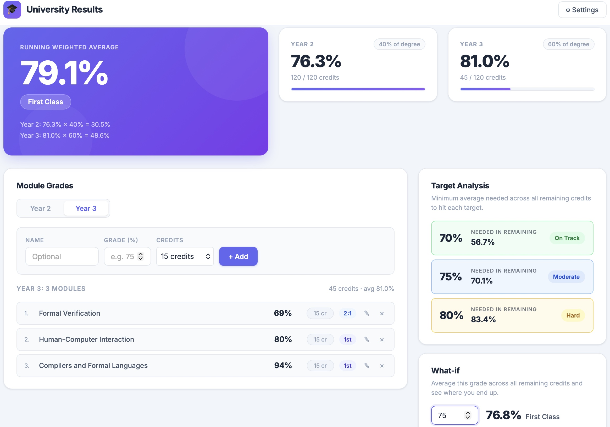

# University Results Calculator

A lightweight browser app for tracking your degree average as you go, with a running weighted average (RWA) that updates the moment you add a grade.

No install, no build step — just open `index.html`.



---

## What it does

- Tracks module grades across Year 2 and Year 3, each with configurable credit weightings
- Computes a **running weighted average** normalised to the years that have data (so if you've only entered Year 2 grades, the RWA reflects Year 2 alone, not a half-baked weighted sum)
- For each target grade (default: 70%, 75%, 80%), shows the average you need across all remaining credits to hit it
- Persists your grades in browser local storage — grades survive page refreshes

## How to run

```
open index.html
```

Or double-click it in Finder. That's it.

To run the Python version (useful for scripting or checking the maths):

```bash
python uni_results.py
```

Requires Python 3. No third-party packages.

## How the RWA is calculated

Each year has a weighting (e.g. Year 2 = 40%, Year 3 = 60%). The RWA is the weighted average of the year averages, normalised by the total weight of years that have any grades entered:

```
RWA = Σ(weight_i × year_avg_i) / Σ(weight_i)
```

where the sums are only over years with at least one grade. This means the RWA is always a meaningful percentage, not a partial weighted sum.

The **required average** calculation works backwards: given how much of the degree is already locked in, what average do you need across all remaining credits (across all years) to reach the target?

## Settings

Click **Settings** to change:

- Year weightings (they don't need to sum to 100)
- Total credits per year (default: 120 each)
- Target grades shown in the analysis panel

Settings are saved in local storage alongside your grades.

## Project structure

```
index.html       — app shell and settings modal
style.css        — all styling, no framework
app.js           — UniResults class + UI logic
uni_results.py   — same logic in Python, runnable standalone
```

## Customising for your course

If your degree weights Year 1, or uses a different credit structure, update the defaults in `app.js`:

```js
const DEFAULT_STATE = {
  weightings: { 2: 0.4, 3: 0.6 },
  totalCredits: { 2: 120, 3: 120 },
  ...
};
```

Or just change it at runtime via Settings without touching the code.
